# SurgeShield 🛡️ - System & Requirement Mermaid Diagrams

This document contains complete, production-grade **Mermaid diagrams** for **SurgeShield**, covering the **Overall System Architecture** as well as individual architectural and sequence diagrams for every platform requirement specified in the problem statement.

---

## 📐 Table of Contents

1. [Overall System Architecture Diagram](#1-overall-system-architecture-diagram)
2. [Requirement 1: Remain Available During Sudden Traffic Spikes](#requirement-1-remain-available-during-sudden-traffic-spikes)
3. [Requirement 2: Prevent Excessive Latency and Failed Requests](#requirement-2-prevent-excessive-latency-and-failed-requests)
4. [Requirement 3: Automatically Add Capacity During Peak Traffic](#requirement-3-automatically-add-capacity-during-peak-traffic)
5. [Requirement 4: Remove Excess Capacity After Traffic Stabilizes](#requirement-4-remove-excess-capacity-after-traffic-stabilizes)
6. [Requirement 5: Prevent Duplicate Registrations](#requirement-5-prevent-duplicate-registrations)
7. [Requirement 6: Prevent Overbooking When Multiple Users Request Last Available Seats](#requirement-6-prevent-overbooking-when-multiple-users-request-last-available-seats)
8. [Requirement 7: Detect Failed or Unhealthy Service Instances](#requirement-7-detect-failed-or-unhealthy-service-instances)
9. [Requirement 8: Handle Temporary Failures in Downstream Dependencies](#requirement-8-handle-temporary-failures-in-downstream-dependencies)
10. [Requirement 9: Process Notifications Asynchronously](#requirement-9-process-notifications-asynchronously)
11. [Requirement 10: Alert the Operations Team When User Experience or System Health is at Risk](#requirement-10-alert-the-operations-team-when-user-experience-or-system-health-is-at-risk)
12. [Requirement 11: Provide Dashboards That Explain What Happened During Traffic Surges](#requirement-11-provide-dashboards-that-explain-what-happened-during-traffic-surges)

---

## 1. Overall System Architecture Diagram

This diagram presents the full microservices topology of SurgeShield, showcasing traffic flow from external clients through the Traefik Ingress Gateway into the auto-scaled API and Worker container tiers backed by Redis 7 and PostgreSQL 16, alongside the custom metrics-based Docker Swarm autoscaler and full Prometheus/Grafana/Alertmanager observability stack.

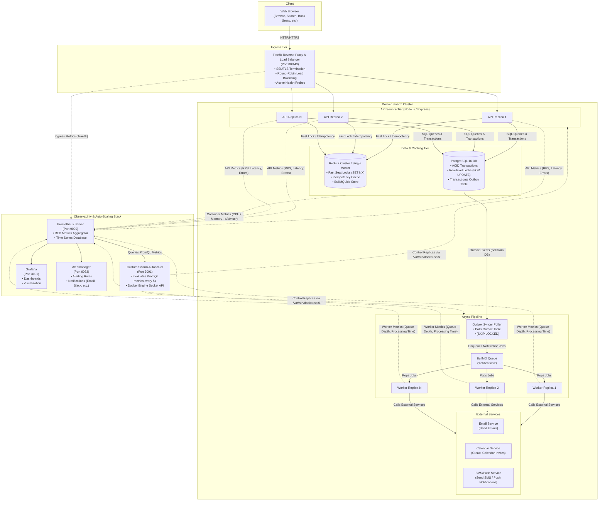

---

## Requirement 1: Remain Available During Sudden Traffic Spikes

> **Goal**: Ensure 99.9%+ availability when traffic spikes from 10 to 1,000+ RPS without cascading failures or web server crashes.

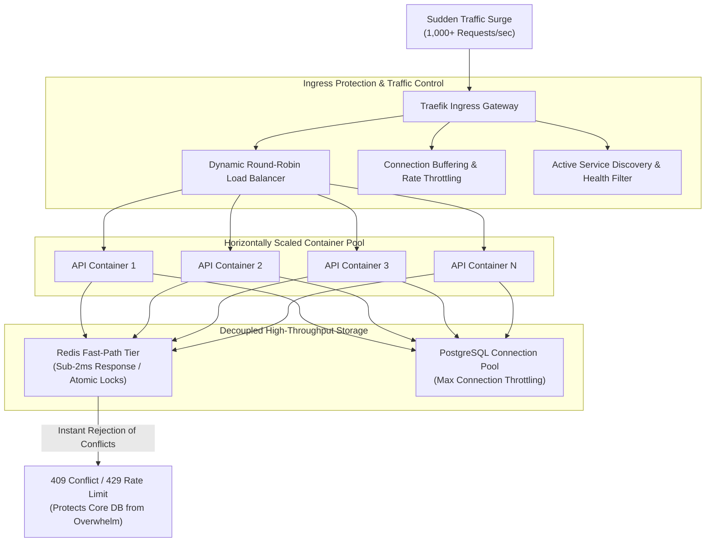

---

## Requirement 2: Prevent Excessive Latency and Failed Requests

> **Goal**: Prevent tail latency degradation ($p_{99} < 100\text{ms}$) by using in-memory fast rejection and DB connection pooling.

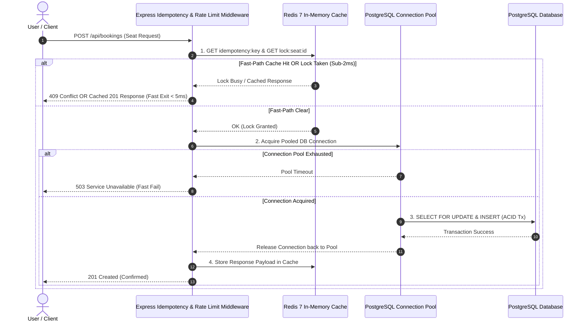

---

## Requirement 3: Automatically Add Capacity During Peak Traffic

> **Goal**: Evaluate metrics every 5 seconds and scale out container replicas automatically when RPS or CPU utilization exceeds thresholds.

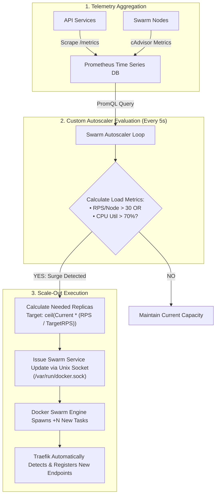

---

## Requirement 4: Remove Excess Capacity After Traffic Stabilizes

> **Goal**: Gracefully scale down excess service containers after traffic drops, using a hysteresis cooldown timer to prevent anti-flapping.

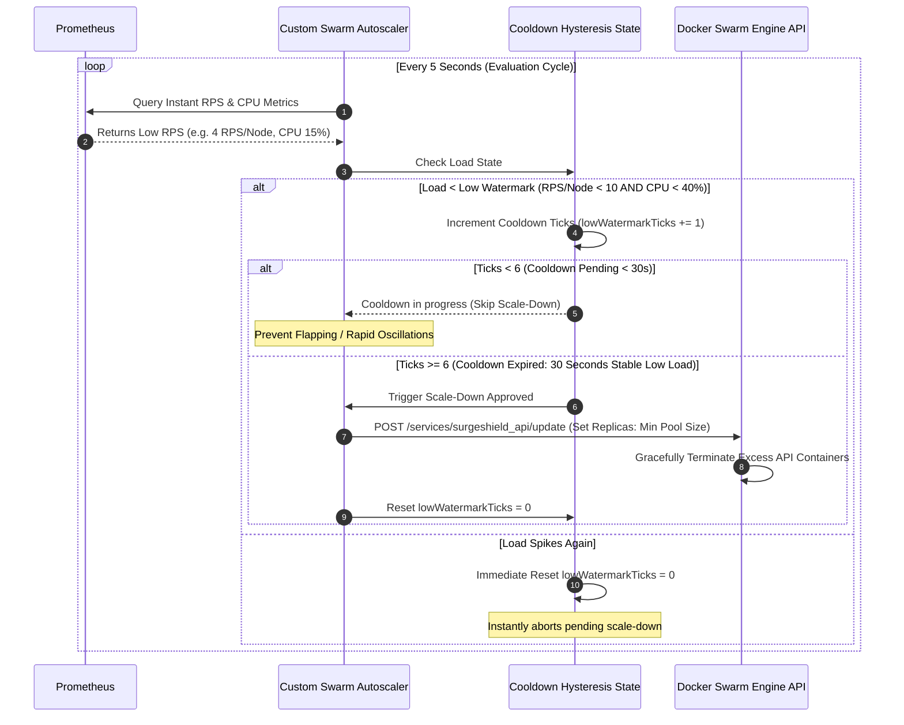

---

## Requirement 5: Prevent Duplicate Registrations

> **Goal**: Idempotency key handling prevents double submissions caused by network retries or fast double-clicking.

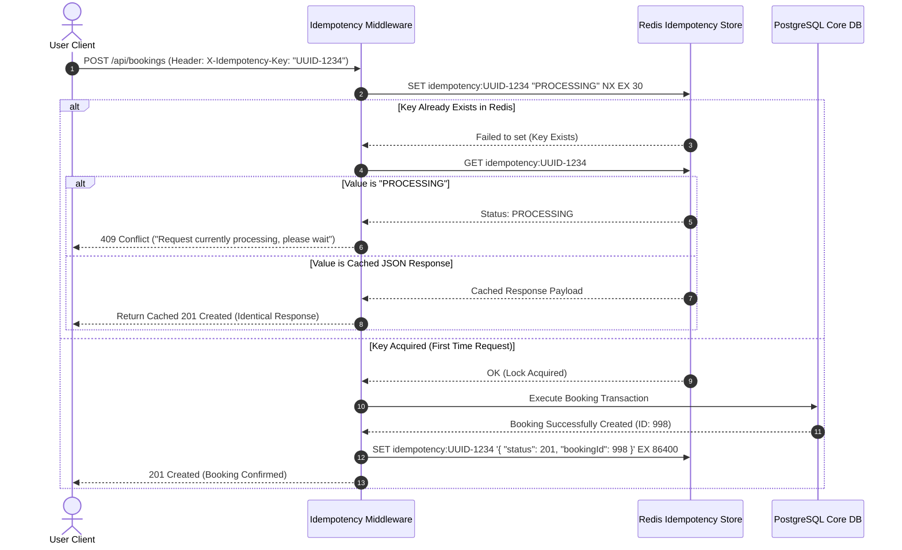

---

## Requirement 6: Prevent Overbooking When Multiple Users Request Last Available Seats

> **Goal**: Dual-Tier Concurrency Control ensures absolute zero overbooking under high-concurrency race conditions.

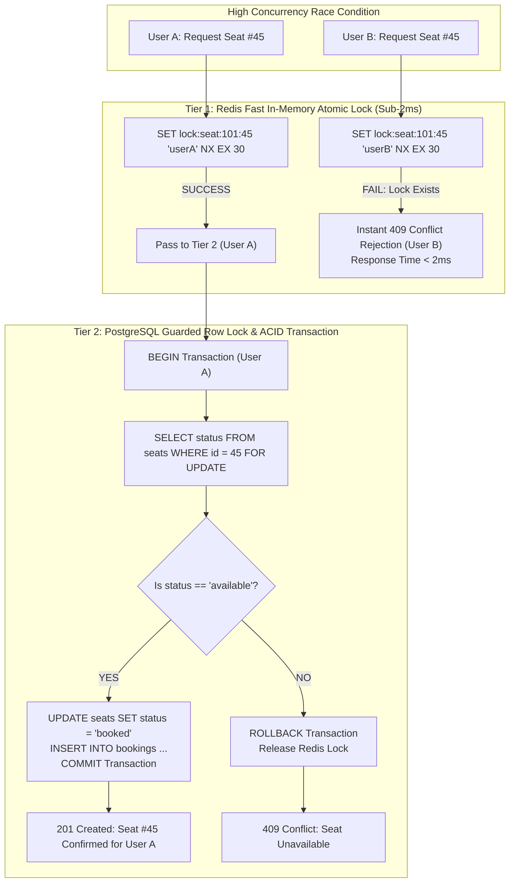

---

## Requirement 7: Detect Failed or Unhealthy Service Instances

> **Goal**: Continuous health monitoring and dynamic target updates remove failed instances automatically.

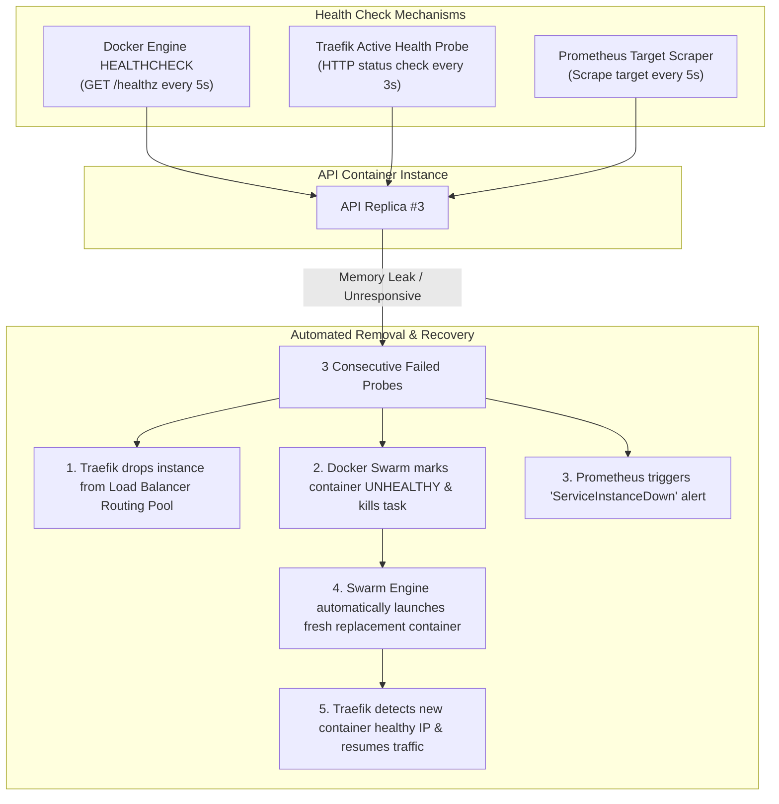

---

## Requirement 8: Handle Temporary Failures in Downstream Dependencies

> **Goal**: Maintain system stability and zero data loss during database, Redis, or network blips using resilient retry strategies and transactional outbox patterns.

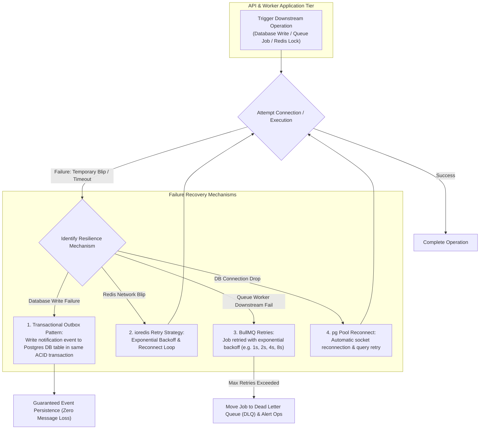

---

## Requirement 9: Process Notifications Asynchronously

> **Goal**: Decouple slow email sending and calendar invite generation from HTTP response paths using the Transactional Outbox pattern and BullMQ worker queue.

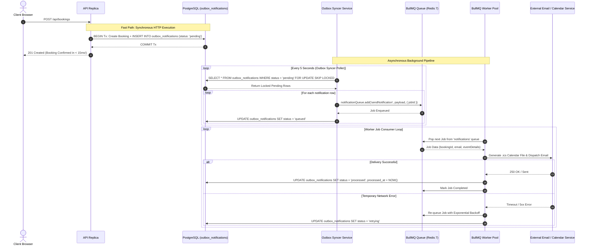

---

## Requirement 10: Alert the Operations Team When User Experience or System Health is at Risk

> **Goal**: Detect anomalies in real-time and trigger automated alerts when latency, error rates, or queue depth exceed safety limits.

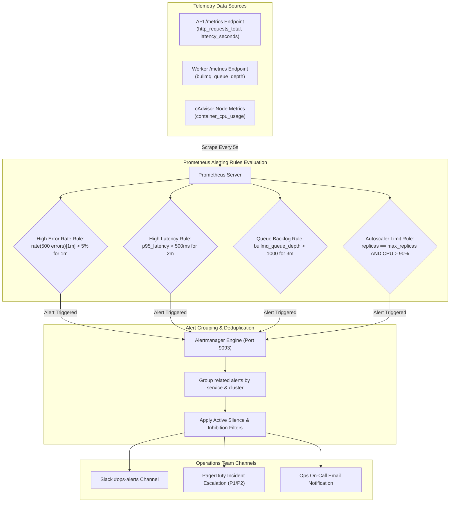

---

## Requirement 11: Provide Dashboards That Explain What Happened During Traffic Surges

> **Goal**: Offer real-time visual dashboards in Grafana that correlate traffic surges, scale-out events, response latencies, and queue depths.

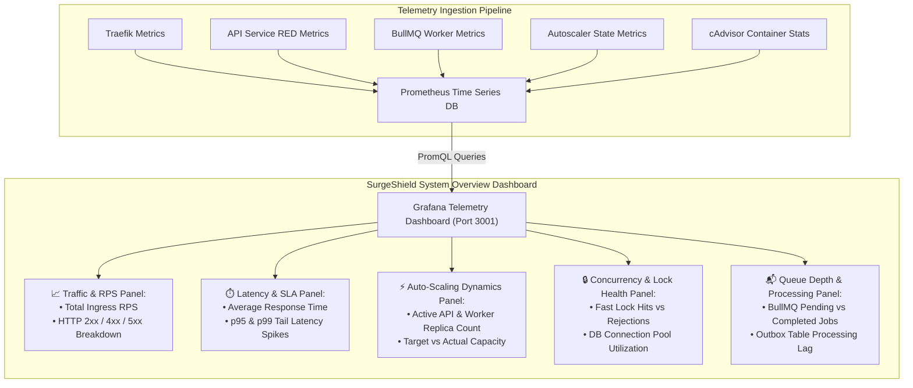
