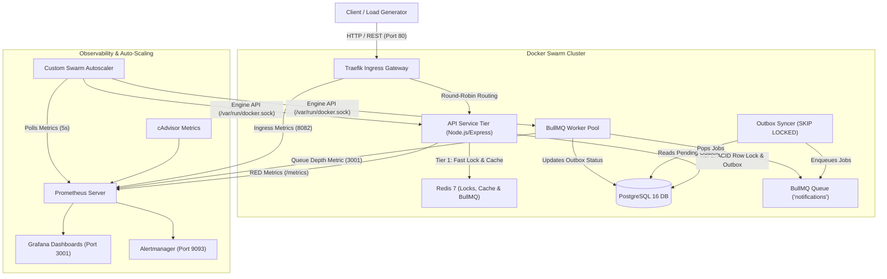
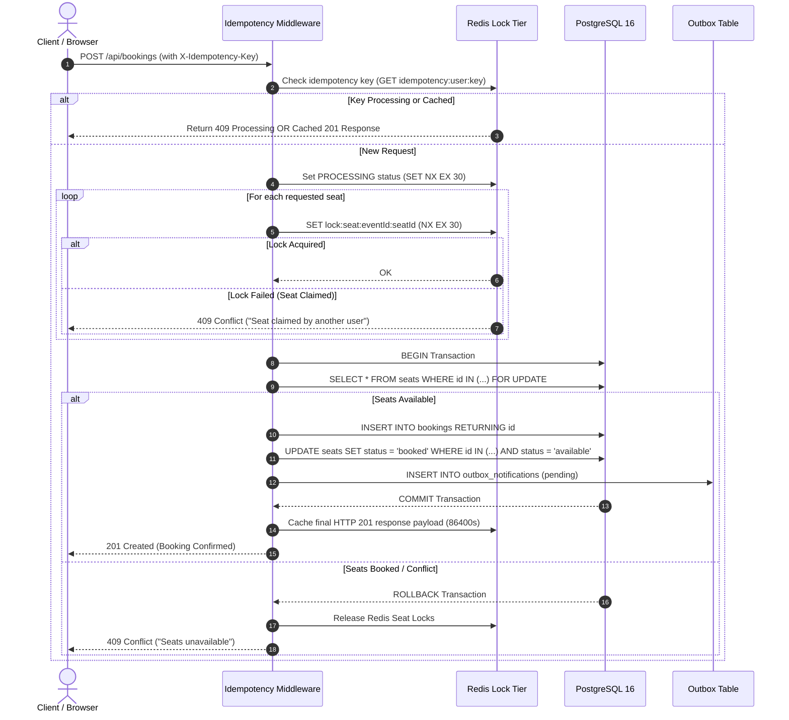
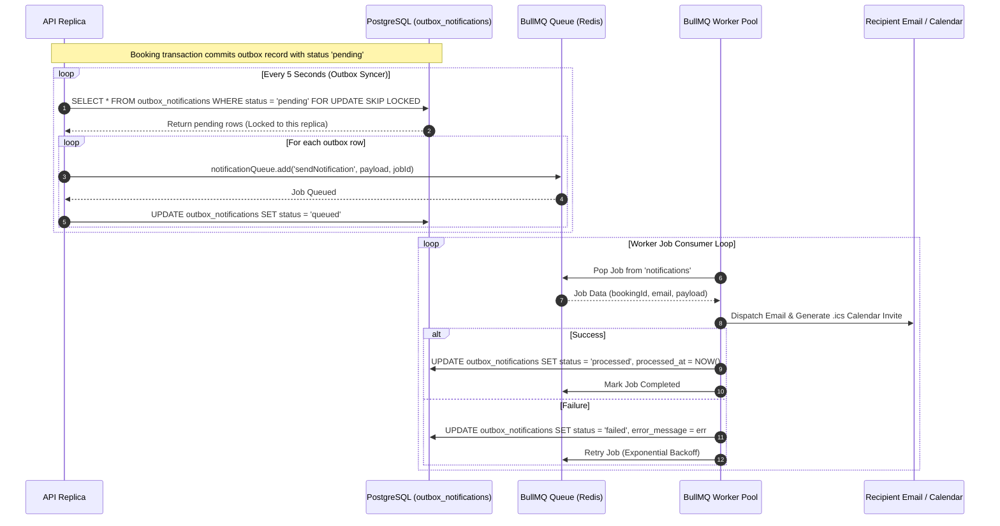
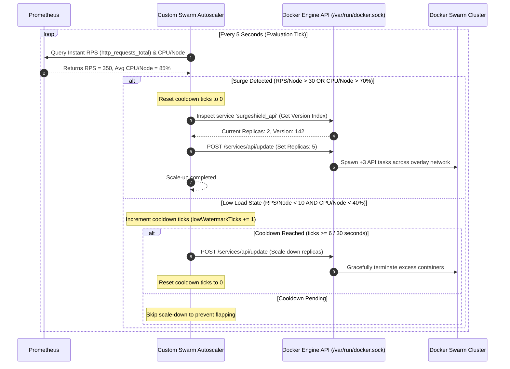
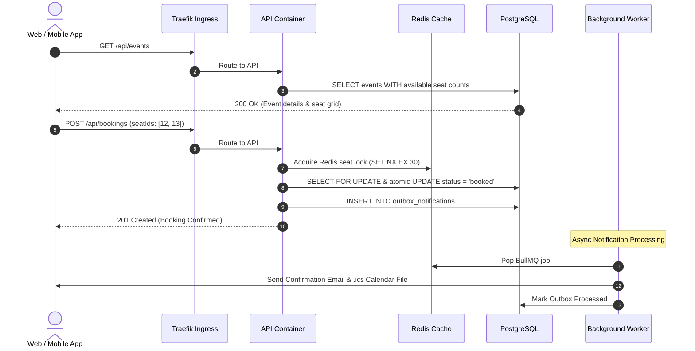

# SurgeShield 🛡️

**SurgeShield** is a resilient, self-scaling event-registration and ticketing platform designed to handle extreme traffic surges (10 ➔ 1,000+ RPS) without overbooking, duplicate registrations, or service degradation.

Built with **Node.js/Express**, **PostgreSQL 16**, **Redis 7**, **BullMQ**, **Traefik**, and **Docker Swarm**, SurgeShield features custom metrics-driven horizontal auto-scaling, sub-2ms fast-path seat locking, response idempotency caching, and transactional outbox messaging.

---

## 🏛️ System Architecture

SurgeShield uses a decoupled microservice architecture orchestrated via Docker Swarm mode. Traffic enters through Traefik Ingress and is distributed across auto-scaled API containers backed by Redis and PostgreSQL clusters.



---

## 🔄 Sequence Diagrams

### 1. Dual-Tier Concurrency Control & Seat Booking Flow

SurgeShield enforces a **Zero-Overbooking Guarantee** using two layers of concurrency checks:
1. **Tier 1 (Redis In-Memory Lock)**: Provides sub-2ms fast rejection (`SET lock:seat:<eventId>:<seatId> <userId> NX EX 30`).
2. **Tier 2 (Postgres Guarded Row Lock)**: Uses `SELECT ... FOR UPDATE` and atomic SQL status updates inside serializable transactions.



---

### 2. Transactional Outbox & BullMQ Async Notification Flow

Notifications and calendar invites are decoupled from HTTP response paths using the **Transactional Outbox Pattern** combined with **BullMQ**.



---

### 3. Dynamic Auto-Scaling & Cooldown Hysteresis Loop

The custom Node.js autoscaler monitors Prometheus metrics and adjusts Swarm service replica counts in real-time while preventing anti-flapping through hysteresis cooldowns.



---

### 4. End-to-End User Registration & Lifecycle Flow



---

## 📂 Project Directory Structure

```
SurgeShield-WorkDay/
├── autoscaler/                 # Custom Dockerode Swarm Autoscaler
│   ├── src/
│   │   ├── index.js            # Autoscaler polling loop & status server (Port 9091)
│   │   ├── prometheusClient.js # PromQL metric fetcher
│   │   └── swarmScaler.js      # Docker Engine Unix Socket HTTP API client & hysteresis
│   └── Dockerfile
├── backend/                    # Core Production Express API & Worker Engine
│   ├── src/
│   │   ├── controllers/        # Bookings & Events HTTP controllers
│   │   ├── db/                 # SQL schemas & pool management
│   │   ├── middleware/         # Idempotency cache & error handlers
│   │   ├── routes/             # API routing endpoints (/api/events, /api/bookings)
│   │   ├── services/           # Dual-tier booking & outbox notification services
│   │   ├── db.js               # Central pg Connection Pool
│   │   ├── index.js            # Express REST server (Port 4000)
│   │   ├── redis.js            # ioredis client & lock helpers
│   │   └── worker.js           # BullMQ Worker process & metrics server (Port 3001)
│   ├── Dockerfile
│   └── package.json
├── frontend/                   # Next.js Web Portal
│   ├── pages/                  # Event listings, seat selection grid, booking views
│   └── styles/
├── load-testing/               # Traffic Generator CLI
│   └── surgeGen.js             # Support for --profile burst, --profile cool, --profile idempotency
├── observability/              # Observability Configurations
│   ├── alertmanager/           # Alert routing & rules
│   ├── grafana/                # Provisioned dashboards (surgeshield-overview.json)
│   └── prometheus/             # Prometheus target scrape configs & PromQL rules
├── docker-compose.yml          # Production Docker Swarm Stack Specification
├── README_INFRA.md             # Teammate Infrastructure Integration Guide
└── README.md                   # Complete System Documentation
```

---

## ⚡ Quick Start & Deployment Guide

### Prerequisites
- [Docker Desktop](https://www.docker.com/) with Swarm Mode enabled (`docker swarm init`).
- [Node.js 20+](https://nodejs.org/).

### 1. Initialize Docker Swarm & Deploy Stack

```powershell
# 1. Initialize Docker Swarm (if not already active)
docker swarm init

# 2. Build Production Container Images
docker build -t surgeshield/api:latest ./backend
docker build -t surgeshield/worker:latest ./backend
docker build -t surgeshield/autoscaler:latest ./autoscaler

# 3. Deploy Stack to Docker Swarm
docker stack deploy -c docker-compose.yml surgeshield
```

### 2. Verify Services

Check running Docker Swarm services:
```powershell
docker service ls
```

---

## 📊 Observability & System Dashboards

| Service | Endpoint | Description |
| :--- | :--- | :--- |
| **Ingress Gateway** | `http://localhost` | Traefik Reverse Proxy & Load Balancer |
| **Traefik UI** | `http://localhost:8080` | Router & Service Health Dashboard |
| **Grafana** | `http://localhost:3001` | System Overview Dashboard (User: `admin` / `admin`) |
| **Prometheus UI** | `http://localhost:9090` | PromQL Query Browser & Targets |
| **Alertmanager** | `http://localhost:9093` | Alert Trigger Console |
| **Autoscaler Status** | `http://localhost:9091/status` | Live Replica Count & Cooldown Ticks |

---

## 🧪 Load Testing & Verification

Run the load testing script to test burst auto-scaling, scale-down cooldown, or idempotency checks:

```powershell
# Burst Test: High Concurrency (10,000+ Requests in 30s)
node load-testing/surgeGen.js --profile burst

# Idempotency Test: Verify 10 duplicate requests return identical cached response
node load-testing/surgeGen.js --profile idempotency

# Cooldown Test: Low traffic (2 RPS) to observe scale-down hysteresis
node load-testing/surgeGen.js --profile cool
```

---

## 🛡️ Concurrency & Resilience Guarantees

1. **Zero Overbooking Guarantee**: Combines Redis in-memory locks with PostgreSQL row locks (`SELECT FOR UPDATE`) and atomic SQL seat assignment (`UPDATE ... WHERE status = 'available'`).
2. **Strict Idempotency**: Intercepts duplicate client requests via Redis (`SET ... NX EX 30`) and enforces database uniqueness constraints on `idempotency_key`.
3. **Anti-Flapping Autoscaling**: Instant scale-up during traffic bursts combined with a 6-tick (30 second) hysteresis cooldown before step-down.
4. **Reliable Async Processing**: Uses PostgreSQL transactional outbox table with `FOR UPDATE SKIP LOCKED` and BullMQ workers for zero-message-loss processing.
